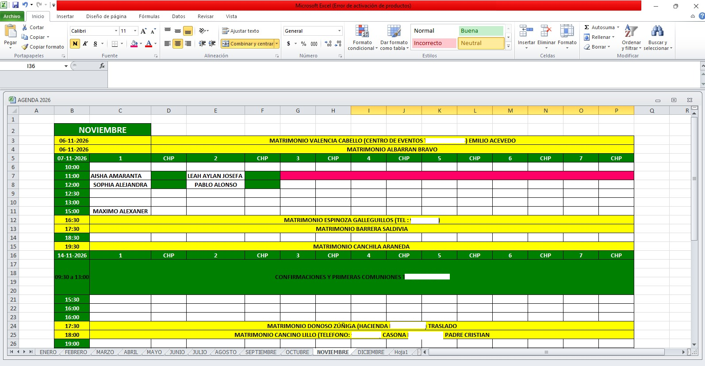
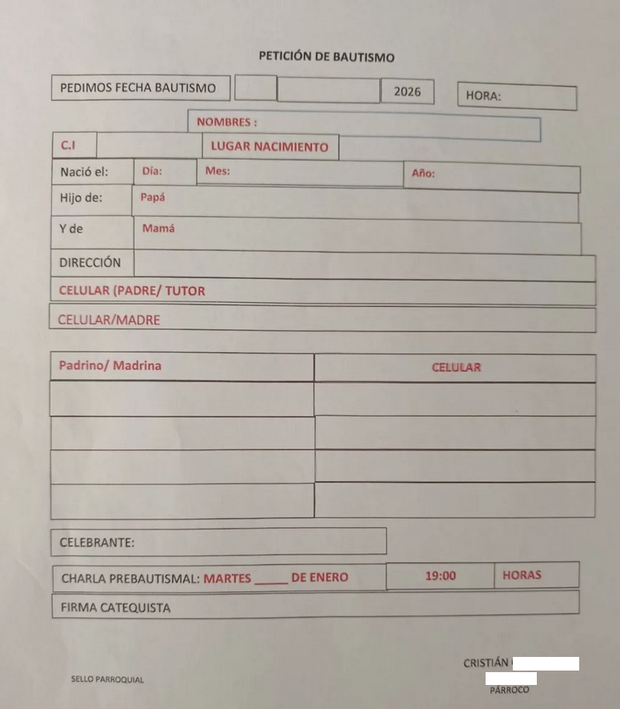
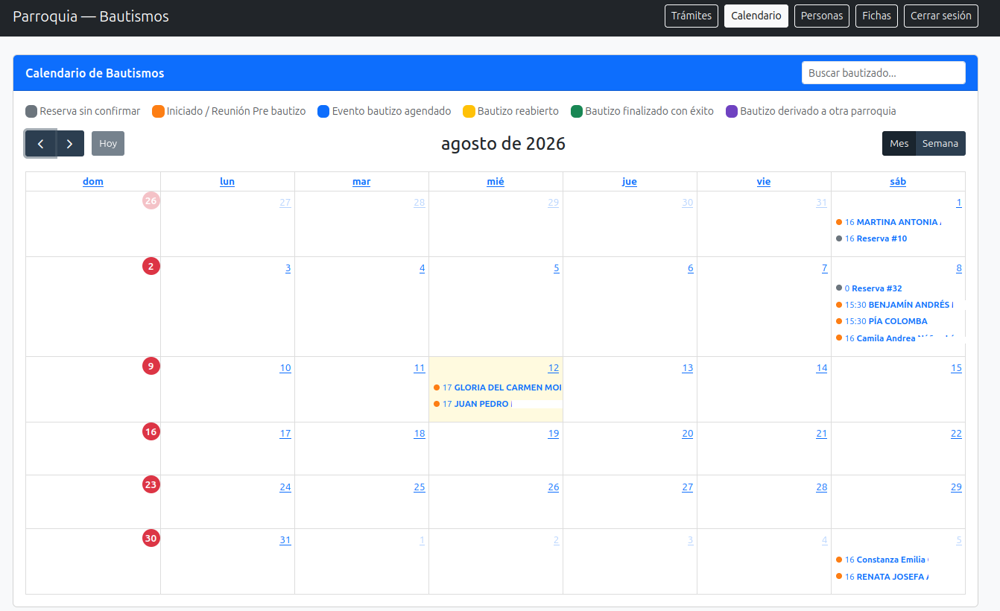
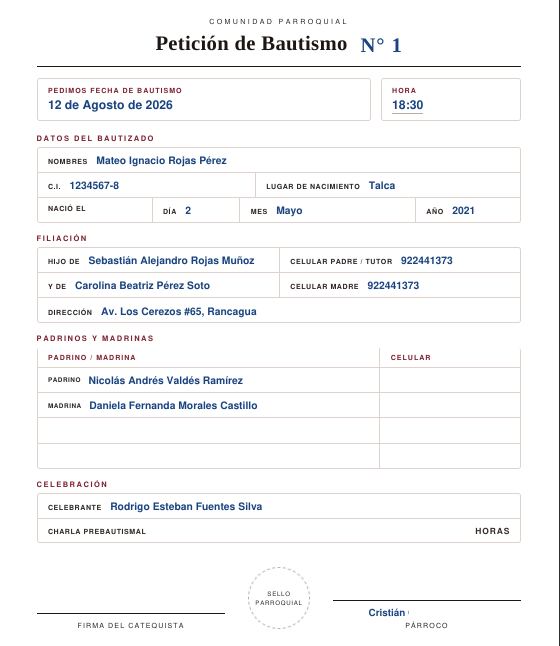
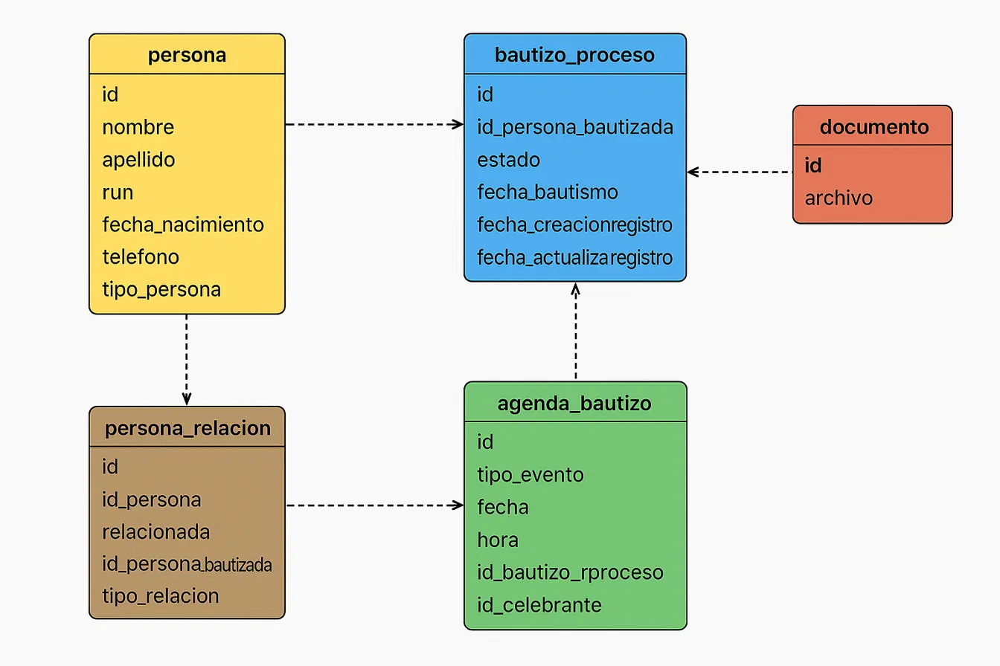
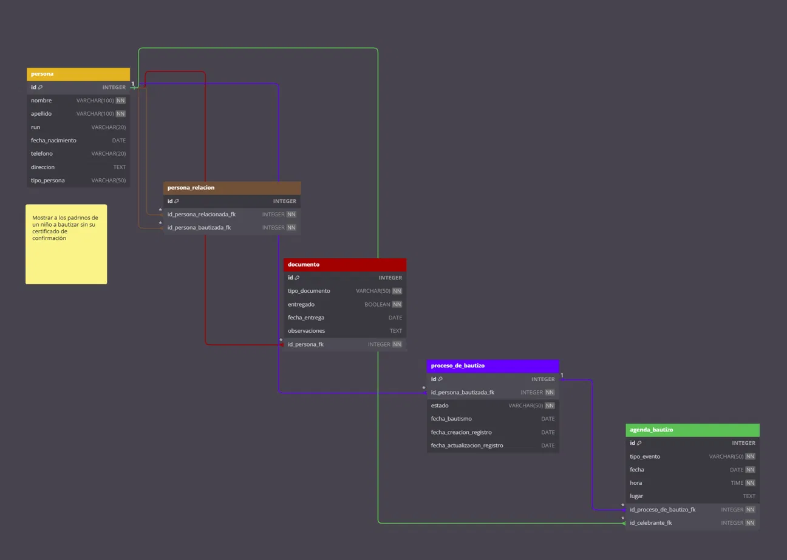
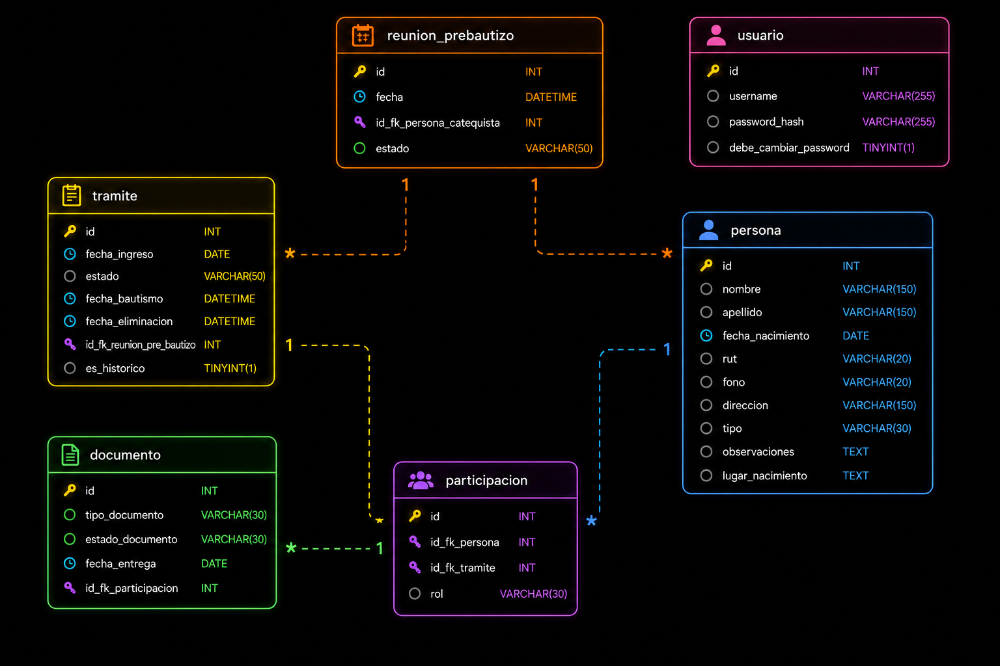

<p align="center">
  
</p>

<h1 align="center">Sistema de Gestión de Bautizos</h1>

<p align="center">
 Sistema web para gestionar los trámites de bautismos para la parroquía Divino Maestro de Rancagua.
</p>


## Problema

La secretaría del establecimiento trabajaba mediante la utilización de una planilla Excel que funcionaba como su agenda para registrar solo algunas partes del trámite. Solo quedaban registradas las fechas disponibles/asignadas, horas, nombre de la persona a bautizarse, fono (dato que no siempre estaba presente) y el tipo de bautizo público o privado. Los demás datos estaban almacenados de forma física en cuadernos, carpetas e incluso hojas de papel sueltas.

Los datos de un trámite se registraban en lo que se tuviera a mano, documento de Word, cuaderno, hojas de papel y la gran mayoría de estos quedaban en un limbo esperando a ser retomados. Algunos simplemente se perdían, obligando a rehacer el trámite desde cero.

<table align="center">
  <tr> 
    <td align="center">
      <br />
      <sub><b>Gestión de los eventos del mes de Noviembre, mezclas de bautizos, matrimonios y otros eventos</b></sub>
    </td>
    <td align="center">
      <br />
      <sub><b>Ficha estandar para petición de bautizos utilizada por la parroquía</b></sub>
    </td>
  </tr>
</table>


> 📌 La agenda registraba fechas y nombres; el resto del trámite vivía en fichas físicas como esta.

---

## Capturas de la solución

<table align="middle">
  <tr>
    <td align="middle">
      <br />
      <sub><b>Tramites de bautizos desplegados en el calendario por fecha de celebración</b></sub>
    </td>
    <td align="middle">
      <br />
      <sub><b> Rediseño de la ficha imprimible para petición de bautizos</b></sub>
    </td>
  </tr>
</table>

> 📌 El calendario centraliza los trámites por fecha y estado. La ficha bautismal se genera desde el mismo sistema.

---

## ¿Qué hace el software?

- Registro de trámites de bautizo con seguimiento de estado.
- Gestión de participantes para cada trámite (bautizado, padres, padrinos, catequista, celebrante).
- Asignación y seguimiento de reunión prebautismal.
- Calendario para la creación y visualización de trámites por fecha y estado.
- Seguimiento de documentos asociados a cada participante.
- Descarga e impresión de ficha bautismal.
- Gestión de personas del sistema (catequistas, celebrantes, familiares).

---

## Base de Datos

La creación de la base de datos pasó por tres tipos de diseño, utilizando como base una planilla Excel con registros de trámites de bautizos completados del año 2023. Esta planilla tiene la particularidad de que todos los roles están separados por columnas. <br>

<p align="center">
<br />
</p>

La primera iteración fue rápidamente descartada, ya que no era capaz de modelar el proceso de un trámite, solo almacenar datos de forma rígida. La segunda iteración normalizó `persona` y conectó documento y agenda, pero las tablas `proceso_de_bautizo` y `agenda_bautizo` eran redundantes, ambas disputaban las fechas del evento, y `agenda_bautizo` mezclaba esa fecha con la participación del celebrante en una misma tabla. No existía `reunion_prebaustismal`, una fase obligatoria que bloquea el avance del trámite.


<p align="center">
<br />
</p>

La tercera iteración toma a `Tramite` como eje principal del proceso, `Participación` vincula a cada persona a un trámite y un rol sin límites de columnas fijas, la existencia de pasos claves como la reunión prebautismal con su propia tabla genera una dependencia para el tramite, si la reunión no se completa no se puede seguir avanzando de fase.


<p align="center">
<br />
</p>

---


### Relaciones entre entidades

#### 🟡 Trámite - 🔵 Persona

- Un **trámite** (`tramite`) puede involucrar a **una o varias personas** (`persona`) desempeñando distintos roles. A su vez, una **persona** puede participar en **uno o varios trámites** a lo largo del tiempo.


> [!IMPORTANT]
> **Entidad Resultante: `Participacion`**
>  La entidad <code>participacion</code> registra la participación de una <code>persona</code> dentro de un <code>tramite</code>, asignándole un rol específico (bautizado, padre, madre, padrino, madrina, testigo, celebrante o padre/madre homoparental).
> Una misma <code>persona</code> puede participar en múltiples <code>tramite</code>, pero solo puede desempeñar **un único rol dentro del mismo trámite**.


#### 🟣 Participación - 🟢 Documento

- Una **participación** (`participacion`) puede tener asociados **uno o varios documentos** (`documento`) que respalden el rol del participante dentro del trámite. Cada **documento** pertenece exclusivamente a **una sola participación**.


#### 🟡Trámite - 🟠 Reunión prebautismal

- Un **trámite** (`tramite`) tiene asignada una única **reunión prebautismal** (`reunion_prebautismal`) como requisito para avanzar en el proceso y esa **reunión prebautismal** puede estar asociada a **un solo trámite**.


#### 🔵 Persona - 🟠 Reunión prebautismal

- Un **catequista** (`persona`) puede estar a cargo de **una o varias reuniones prebautismales** (`reunion_prebautismal`). Cada **reunión prebautismal** está a cargo de **un único catequista**.


---

## Stack

**Back-end**

| Tecnología | Rol |
| :--- | :--- |
| Node.js + Express | Runtime y framework web |
| Joi | Validador de schemas |
| MySQL | Base de datos relacional |
| Sequelize | ORM |

- Joi valida y sanitiza los datos entrantes antes de que lleguen al controlador, actuando como capa de validación del backend.
- MySQL almacena datos con estructura y relaciones definidas entre
entidades, apropiado para un modelo con reglas de negocio claras.
Sequelize mapea esa estructura a objetos JavaScript, evitando
escribir SQL crudo para cada consulta.


**Front-end**

| Tecnología | Rol |
| :--- | :--- |
| EJS | Motor de vistas |
| Bootstrap | Framework CSS |
| DataTables | Plugin de tablas |

- EJS conserva la sintaxis HTML estándar, a diferencia de motores
como Pug que la reemplazan por una propia. Bootstrap y DataTables
permiten construir una interfaz funcional sin invertir tiempo en
CSS ni en lógica de tablas desde cero.

**Infraestructura**

| Tecnología | Rol |
| :--- | :--- |
| Railway | Hosting y base de datos |

- Plan Hobby, $5 mensuales, bajo costo para el despliegue del proyecto.
---

## Estado
### Uso
- El software está en producción desde el `8 de Junio de 2026` en su versión `2.0`
- La secretaría utiliza el sistema en paralelo: registrando trámites nuevos y digitalizando los anteriores que aún estaban en cuadernos.
- Volumen actual de la base de datos de producción: `59 trámites`, `242 personas`, `265 participaciones`.

### Limitaciones
- La lógica de negocio en los servicios no tiene cobertura de tests unitarios
- El comportamiento de los formularios (middleware, controlador, servicios) se ejecutó con scripts de Playwright generados por IA, enfocando la revisión únicamente en la aprobación o descarte de los resultados.
- Ausencia de un marco de migraciones versionado de base de datos, requiriendo la gestión manual de las actualizaciones en la estructura de tablas mediante Railway o MySQL Workbench.
- No es posible almacenar documentos (PDF u otros formatos) en la base de datos, únicamente se registra su estado.
---

## Ejecución local

### Requisitos
- Instalar Node.js en su versión `v18.19.1` o superior
- Instalar MySQL en su versión `8.0.45` o superior
- Copiar y pegar el esquema de la base de datos alojado en `db/script.sql` en el motor de la base de datos
### Clonar el repositorio
```bash
https://github.com/ccastrom/parroquia-api.git
```
### Instalación


```bash
cd src
npm install
node server.js
```

### Variables de entorno utilizadas en el sistema.
Revisar el archivo `src/.env.example`, que contiene las variables requeridas por la aplicación, y renombrarlo como `.env `para evitar errores de ejecución.
```bash
PORT — puerto del servidor express.js (default express.js:3000)
DB_HOST — host de la base de datos
DB_PORT — puerto de la base de datos (default MySQL: 3306)
DB_USER — usuario de la base de datos
DB_PASSWORD — contraseña de la base de datos
DB_NAME — nombre de la base de datos
PORT — puerto donde corre el servidor (default: 3000)
--
SESSION_SECRET - String para la firma de cookies de sesión, debe ser un valor aleatorio y privado.
API_KEY - String para proteger las rutas de la API.
```
`SESSION_SECRET` y `API_KEY` requieren un string aleatorio seguro. 
Ejecutar el siguiente comando una vez por cada variable:

```bash
node -e "console.log(require('crypto').randomBytes(32).toString('hex'))"
```


El schema de la base de datos incluye un `INSERT` con un usuario inicial con contraseña `12345` hasheada.
El sistema solicitará cambiar la contraseña en el primer login.


